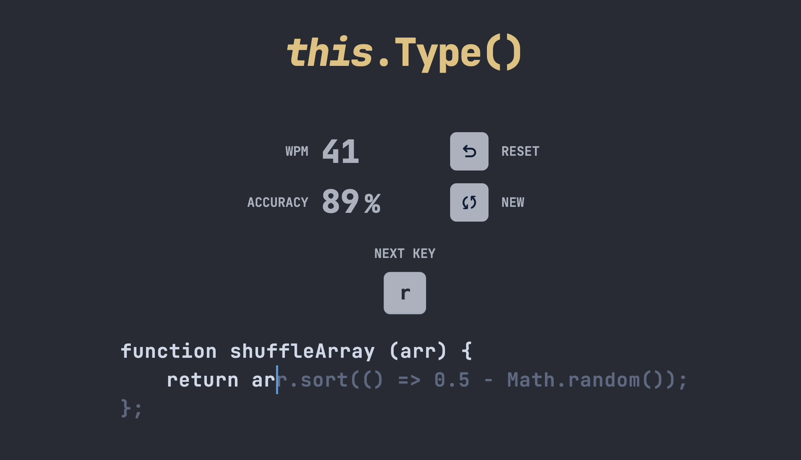

# <em>this</em>.Type()

<br/>



<p align='center'>
<a href='http://thisdotype.vercel.app'>www.thisdotype.vercel.app</a>
</p>

## About

this.Type() is a typing game that uses code snippets to test your typing speed and accuracy.

## Built with

- Svelte
- SvelteKit
- TailwindCSS
- DaisyUI

## Getting Started

1. Clone this repo

```bash
git clone https://github.com/tunibjork/this.type.git
cd this.type
```

2. Install dependencies

```bash
npm install
```

3. Start development server

```
npm run dev
```
